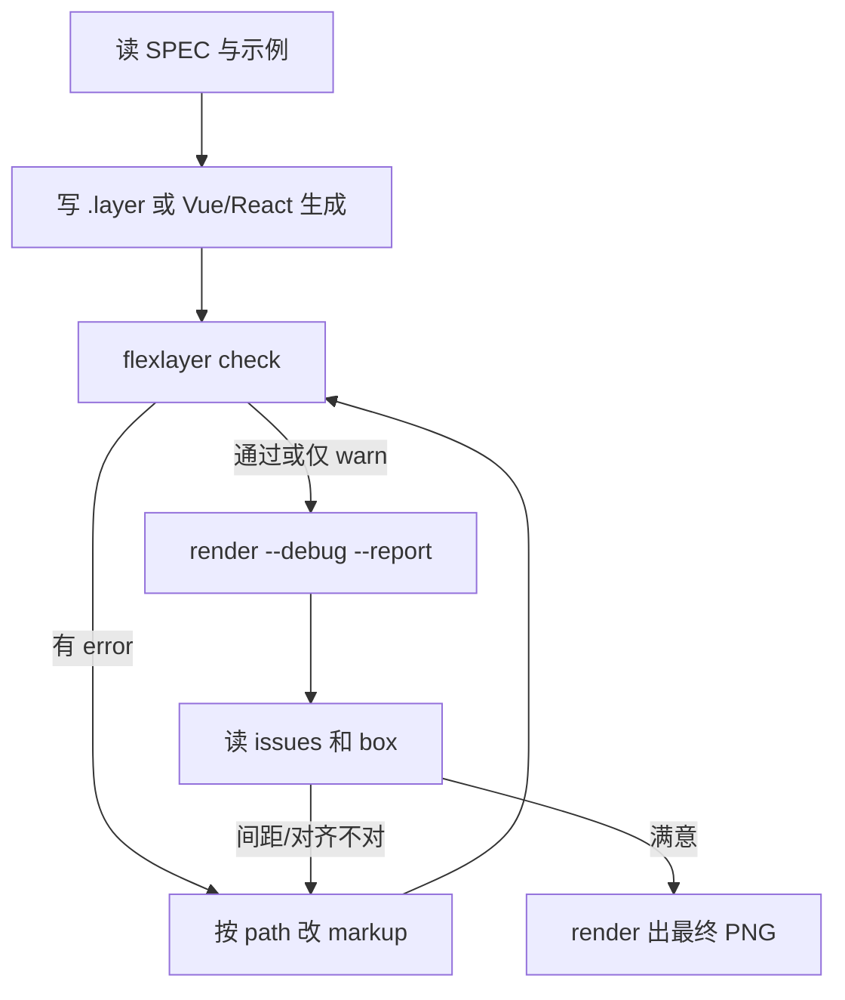

# Flex Layer：生成、验证与 AI 协作

本文说明 Flex Layer 从「写出 markup」到「确认版式正确」的完整链路，以及 AI 应如何高效使用仓库里的工具。标签与属性规则以 [SPEC.md](SPEC.md) 为准；Vue / React 动态生成见 [GENERATE.md](GENERATE.md)；组件见 [generate/COMPONENTS.md](generate/COMPONENTS.md)。

## 1. 三层分工

Flex Layer 刻意把**生成**和**渲染**分开，中间只交接一份 **`.layer` 文本**：

```text
┌─────────────────┐     ┌──────────────┐     ┌─────────────────┐
│ 生成            │     │ .layer 文本    │     │ 验证 + 渲染     │
│ 手写 / Vue /    │ ──► │ 唯一真相源   │ ──► │ check / debug / │
│ React           │     │              │     │ render → PNG    │
└─────────────────┘     └──────────────┘     └─────────────────┘
```

| 层 | 做什么 | 不做什么 |
| --- | --- | --- |
| **生成** | 产出合法 `.layer` 字符串 | 不算最终像素、不画 canvas |
| **验证** | 布局、问题码、元素表、调试图 | 不改源码 |
| **渲染** | 读 `.layer` → PNG + `report.json` | 不跑 Vue / React |

AI 应始终把 **`.layer` 或生成它的脚本**当作可版本化的产物；PNG 和 debug 目录是**验证结果**，用来迭代，不是第二套「真相源」。

## 2. 生成：三种入口

### 2.1 直接写 `.layer`（最常用）

适合海报、单帧、结构不复杂的画面。和 [docs/CHEATSHEET.md](docs/CHEATSHEET.md) 同一条分界：

- **HTML** 用 `style`：字号、颜色、`gap`、`padding`、`background`。排布写 `<div style="display:flex">`。
- **`Layer` 和图形** 用属性：`cx`、`cy`、`r`、`fill`、`stroke`、`shadow`、`glow`、以及其它效果（见 EFFECTS）。标签首字母大写。
- 文字要定位时外包 `<Layer cx cy anchor>`，不要把 `cx` 写在 `h1` 或 `p` 上。

根节点是 `<Layer width="…" height="…" background="…">`。不要写 `row`、`column`。参考 [examples/](examples/)。

### 2.2 Vue 模板

循环、条件、动态 `:cx` 用 Vue 算，输出仍是 `.layer` 文本。

- 依赖与 API：[GENERATE.md](GENERATE.md) → [`generate/vue/`](generate/vue/)
- 可抄模板：[`generate/vue/example.ts`](generate/vue/example.ts)

### 2.3 React JSX

`map` / 条件 / 函数组件，输出同样是 `.layer` 文本。

- 依赖与 API：[GENERATE.md](GENERATE.md) → [`generate/react/`](generate/react/)
- 可抄模板：[`generate/react/example.tsx`](generate/react/example.tsx)

生成后写入文件或直接传给渲染 API：

```bash
npx tsx src/cli.ts render out.layer -o out.png --report out.json
```

```ts
import { renderFvg } from '@dc/flexlayer'
const { png, report } = await renderFvg(source, { baseDir: process.cwd() })
```

## 3. 验证：由轻到重

验证只读 `.layer`，不依赖 Vue / React。

### 3.1 `flexlayer check` — 最快

只跑布局与规则检查，**不出图**：

```bash
npx tsx src/cli.ts check examples/hello.layer
```

得到 JSON 报告（元素 `path`、`box`、`ink`、`issues`）。有 **error** 时进程退出码为 1。适合 CI 或改完 markup 后的第一道门。

### 3.2 `flexlayer render --report` — 出图 + 完整报告

```bash
npx tsx src/cli.ts render scene.layer -o scene.png --report scene.json
```

需要肉眼看效果时用。`--scale 0.5` 可缩小 PNG，加快 AI 目视检查。

### 3.3 `flexlayer render --debug` — 在画面上画出盒子

```bash
npx tsx src/cli.ts render scene.layer -o scene.png --report scene.json --debug --scale 0.5
```

`--debug` 在同一张 PNG 上画出每个元素的布局盒子和着墨范围。`--report` 写出 JSON：元素 `path`、`box`、`ink`、`issues`。先读报告里的 `issues`，再看图。

### 3.4 报告里关键字段

- **`path`**：如 `Layer/Layer[0]/div[0]/h1[0]`，唯一标识节点，与 `issues[].path` 一致。
- **`box`**：布局盒（含 padding）；flex 的 `gap` 体现在**相邻元素 box 之间的空隙**。
- **`ink`**：字形或图形真实着墨；核对「字与字间距」应看 **ink 与 ink**，不是 box 与 box（单行文字的 `line-height` 不会撑高 box）。
- **`effect`**：阴影 / 光晕可能占用的范围；`effect-clipped` 表示光晕被画布裁切。
- **`issues`**：见 [SPEC.md §9](SPEC.md) 问题码表；**error 必须修**，warn 视需求修。

## 4. AI 推荐工作流

下面是一条可重复的闭环，减少「凭感觉调像素」：



**实践要点：**

1. **先规范、后像素**：`Layer` 和图形用属性，HTML 用 `style`。分界错了，报告里会有 `unknown-tag` 或 `warn`。
2. **用 `path` 定位**，不要猜「第几个 child」。
3. **改 gap / padding**：看报告里相邻元素的 box / ink；flex 的 `gap` 写在 `div` 的 `style` 里。
4. **动态海报**：在 Vue / React 层改数据或组件，**重新生成 `.layer`**，再跑 check；不要手改生成结果里的重复片段。
5. **字体**：`<font family src>` 写在 `<Layer>` 下；默认寒蝉端黑体首次渲染会下载到 `~/.cache/flexlayer/fonts`。也可以写 `Song`、`Kai`、`Brush`。
6. **退出码**：`check` / `render` 在存在 **error** 级 `issues` 时退出 1，适合脚本与 CI。

## 5. 写给 AI 的硬性约定

| 约定 | 原因 |
| --- | --- |
| HTML 用 `style`，`Layer` 和图形用属性 | 和渲染器的归属表一致；图形写 `style` 会 `warn` |
| 根与定位用大写 `Layer`，图形首字母大写，文字小写 | `circle` 和 `Circle` 不是同一个标签，小写会被丢掉 |
| 排布用 `div` 的 `display:flex` | `Row` / `Column` 会 `unknown-tag` |
| 线条放在 `Layer` 里，用 `x1`…`d` | 直接放进 flex 不渲染 |
| 文字的 `cx` 写在外包的 `Layer` 上 | 写在 `h1` / `p` 上会 `warn` |
| 多段文字用 flex，别在 `p` 里嵌 `div` | 文字盒子里只能放行内标签 |
| 验证时先读 **`issues` 和 `report.json`** | 数字比压缩图更适合改 markup |

## 6. 常见问题 → 怎么查

| 现象 | 建议 |
| --- | --- |
| 元素跑出画布 | `overflow-canvas`；看 `ink` / `box` 与画布 `width`/`height` |
| 光晕被裁切 | `effect-clipped`；缩小 glow 或移动元素 |
| 字距和 `gap` 不一致 | 读 SPEC `line-height`；用 debug 看 **ink** 间距 |
| flex 子项被挤爆 | 加宽 flex 容器或缩小子项 |
| 阴影/光晕看不见 | 查 `fill`/`stroke`/`glow` 颜色与背景对比；看 `effect` 矩形 |
| 不知道改哪个节点 | 报告里的 `path` |

## 7. 仓库内文档索引

| 文档 | 内容 |
| --- | --- |
| [SPEC.md](SPEC.md) | 标签、属性、布局、报告字段 |
| [docs/CHEATSHEET.md](docs/CHEATSHEET.md) | 一页写法 |
| [docs/EFFECTS.md](docs/EFFECTS.md) | 滤镜 / 效果说明与实现备注 |
| [GENERATE.md](GENERATE.md) | Vue / React 生成 Flex Layer 的依赖与模板 |
| [README.md](README.md) | 安装、常用命令、API 入口 |
| **本文 AI.md** | 生成 + 验证 + AI 协作闭环 |

自动化测试：`npm test`（渲染器）；`npm run test:generate`（生成层 + `layoutSource` 校验）。
