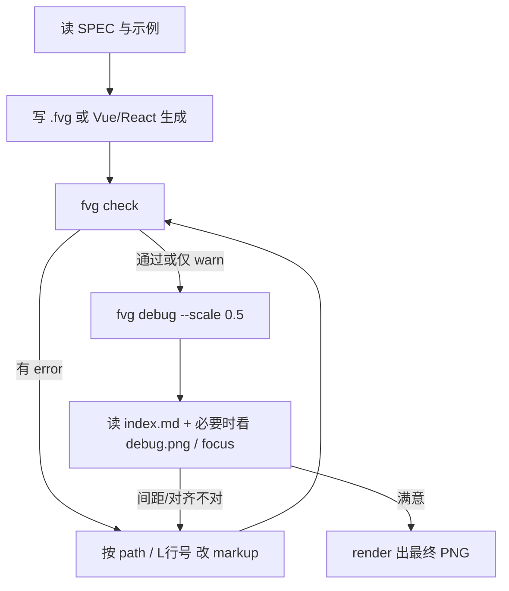

# FVG：生成、验证与 AI 协作

本文说明 FVG 从「写出 markup」到「确认版式正确」的完整链路，以及 AI 应如何高效使用仓库里的工具。标签与属性规则以 [SPEC.md](SPEC.md) 为准；Vue / React 动态生成见 [GENERATE.md](GENERATE.md)。

## 1. 三层分工

FVG 刻意把**生成**和**渲染**分开，中间只交接一份 **`.fvg` 文本**：

```text
┌─────────────────┐     ┌──────────────┐     ┌─────────────────┐
│ 生成            │     │ .fvg 文本    │     │ 验证 + 渲染     │
│ 手写 / Vue /    │ ──► │ 唯一真相源   │ ──► │ check / debug / │
│ React           │     │              │     │ render → PNG    │
└─────────────────┘     └──────────────┘     └─────────────────┘
```

| 层 | 做什么 | 不做什么 |
| --- | --- | --- |
| **生成** | 产出合法 `.fvg` 字符串 | 不算最终像素、不画 canvas |
| **验证** | 布局、问题码、元素表、调试图 | 不改源码 |
| **渲染** | 读 `.fvg` → PNG + `report.json` | 不跑 Vue / React |

AI 应始终把 **`.fvg` 或生成它的脚本**当作可版本化的产物；PNG 和 debug 目录是**验证结果**，用来迭代，不是第二套「真相源」。

## 2. 生成：三种入口

### 2.1 直接写 `.fvg`（最常用）

适合海报、单帧、结构不复杂的画面。遵守一条分界：

- **layer 坐标 / 线条几何** → 标签**属性**：`cx`、`cy`、`anchor`、`x1`、`y1`、`x2`、`y2`、`points`、`d`、`id`
- **其余一切** → **`style="..."`**：`width`、`r`、`fill`、`gap`、`font-size`、`shadow`、`glow` …

标签**全部小写**（与 SVG、HTML 一致）：`fvg`、`layer`、`column`、`circle`、`h1` …

根节点必须是 `<fvg style="width:…; height:…; …">`。参考 [examples/](examples/)。

### 2.2 Vue 模板

循环、条件、动态 `:cx` 用 Vue 算，输出仍是 `.fvg` 文本。

- 依赖与 API：[GENERATE.md](GENERATE.md) → [`generate/vue/`](generate/vue/)
- 可抄模板：[`generate/vue/example.ts`](generate/vue/example.ts)

### 2.3 React JSX

`map` / 条件 / 函数组件，输出同样是 `.fvg` 文本。

- 依赖与 API：[GENERATE.md](GENERATE.md) → [`generate/react/`](generate/react/)
- 可抄模板：[`generate/react/example.tsx`](generate/react/example.tsx)

生成后写入文件或直接传给渲染 API：

```bash
npx tsx src/cli.ts render out.fvg -o out.png --report out.json
```

```ts
import { renderFvg } from '@dc/fvg'
const { png, report } = await renderFvg(source, { baseDir: process.cwd() })
```

## 3. 验证：由轻到重

验证只读 `.fvg`，不依赖 Vue / React。

### 3.1 `fvg check` — 最快

只跑布局与规则检查，**不出图**：

```bash
npx tsx src/cli.ts check examples/hello.fvg
```

得到 JSON 报告（元素 `path`、`box`、`ink`、`issues`）。有 **error** 时进程退出码为 1。适合 CI 或改完 markup 后的第一道门。

### 3.2 `fvg render --report` — 出图 + 完整报告

```bash
npx tsx src/cli.ts render scene.fvg -o scene.png --report scene.json
```

需要肉眼看效果时用。`--scale 0.5` 可缩小 PNG，加快 AI 目视检查。

### 3.3 `fvg debug` — 给 AI 的调试包（推荐迭代时用）

```bash
npx tsx src/cli.ts debug scene.fvg -o scene.debug --scale 0.5 --focus title --focus 2
```

在 `<文件名>.debug/`（或 `-o` 指定目录）生成：

| 文件 | AI 怎么用 |
| --- | --- |
| **`index.md`** | **先读**：画布尺寸、问题列表、元素表（`#n`、标签、`path`、**源码行号 L**、box / ink） |
| `report.json` | 机器读；`elements[n]` 的下标 = 图上 `#n` |
| `render.png` | 最终视觉效果 |
| `debug.png` | 每个元素**盒子**的框线（不标数字）；两条挨近的线 ≈ 中间是 gap / 间距 |
| `focus-N.png` | `--focus id` 或 `--focus 18`（元素编号）时的局部放大 |

`index.md` 也会打印到标准输出。行号 `L12` 对应 `.fvg` 里该元素开标签的行，改 markup 时直接跳转。

### 3.4 报告里关键字段

- **`path`**：如 `fvg/column[0]/h1[0]`，唯一标识节点，与 `issues[].path` 一致。
- **`box`**：布局盒（含 padding）；flex 的 `gap` 体现在**相邻元素 box 之间的空隙**。
- **`ink`**：字形或图形真实着墨；核对「字与字间距」应看 **ink 与 ink**，不是 box 与 box（单行文字的 `line-height` 不会撑高 box）。
- **`effect`**：阴影 / 光晕可能占用的范围；`effect-clipped` 表示光晕被画布裁切。
- **`issues`**：见 [SPEC.md §9](SPEC.md) 问题码表；**error 必须修**，warn 视需求修。

## 4. AI 推荐工作流

下面是一条可重复的闭环，减少「凭感觉调像素」：



**实践要点：**

1. **先规范、后像素**：标签小写、属性 / style 分界错了，后面 debug 会对不上。
2. **用 `path` 和 `L行号` 定位**，不要猜「第几个 child」；`--focus` 用 `id` 或元素表里的 `#n`。
3. **改 gap / padding**：看 `debug.png` 里两条平行线之间的距离，或 `index.md` 里相邻元素的 box / ink 坐标；`column` 的 `style="gap:6px"` 应对齐**着墨**间距（见 SPEC 对 `line-height` 的说明）。
4. **动态海报**：在 Vue / React 层改数据或组件，**重新生成 `.fvg`**，再跑 check / debug；不要手改生成结果里的重复片段（除非一次性微调）。
5. **字体**：`<font family src>` 写在 `<fvg>` 下；默认寒蝉端黑体首次渲染会下载到 `~/.cache/fvg/fonts`。
6. **退出码**：`check` / `debug` / `render` 在存在 **error** 级 `issues` 时退出 1，适合脚本与 CI。

## 5. 写给 AI 的硬性约定

| 约定 | 原因 |
| --- | --- |
| 标签全小写 | 与 SVG/HTML 一致；Vue 小写 = 元素，大写 = 组件 |
| 坐标走属性，视觉走 `style` | 解析与报告一致；混写会触发 `legacy-attr` warn |
| 线条只在 `layer` 里，用 `x1`…`d` | 放进 `row`/`column` 会 `invalid-child` |
| `row`/`column` 子元素不要写 `cx`/`cy` | 无效，会 `ignored-position` |
| 多段文字用 `column`/`row`，别在 `p` 里嵌块级 | 避免布局与换行规则混乱 |
| 验证时优先 **`index.md` + `report.json`**，图片辅助 | 数字比压缩图更适合精确改 markup |

## 6. 常见问题 → 怎么查

| 现象 | 建议 |
| --- | --- |
| 元素跑出画布 | `overflow-canvas`；看 `ink` / `box` 与画布 `width`/`height` |
| 光晕被裁切 | `effect-clipped`；缩小 glow 或移动元素 |
| 字距和 `gap` 不一致 | 读 SPEC `line-height`；用 debug 看 **ink** 间距 |
|  flex 子项被挤爆 | `flex-overflow`；加宽 `column`/`row` 或缩小子项 |
| 阴影/光晕看不见 | 查 `fill`/`stroke`/`glow` 颜色与背景对比；看 `effect` 矩形 |
| 不知道改哪一行 | `index.md` 的 **L** 或 `report.json` 的 `line` |

## 7. 仓库内文档索引

| 文档 | 内容 |
| --- | --- |
| [SPEC.md](SPEC.md) | 标签、属性、布局、报告字段、CLI |
| [ELEMENTS.md](ELEMENTS.md) | 按类别列出每个元素的属性和 style |
| [GENERATE.md](GENERATE.md) | Vue / React 生成 FVG 的依赖与模板 |
| [README.md](README.md) | 安装、常用命令、API 入口 |
| **本文 AI.md** | 生成 + 验证 + AI 协作闭环 |

自动化测试：`npm test`（渲染器）；`npm run test:generate`（生成层 + `layoutSource` 校验）。
