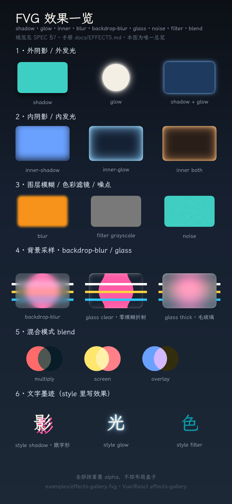

# FVG 滤镜 / 效果手册

现行规范见 [SPEC.md §7](../SPEC.md)。一页速查见 [CHEATSHEET.md](CHEATSHEET.md)。

## 视觉总览（以后只改这里）

完整列举见下图。**新增或改动效果时**：

1. 改 [`examples/effects-gallery.fvg`](../examples/effects-gallery.fvg)
2. 重渲：`npx tsx src/cli.ts render examples/effects-gallery.fvg -o examples/effects-gallery.png`
3. 同步 [`generate/vue/effects-gallery.ts`](../generate/vue/effects-gallery.ts) 与 [`generate/react/effects-gallery.tsx`](../generate/react/effects-gallery.tsx)
4. 如有新属性：改 [`generate/effects.ts`](../generate/effects.ts)、[`generate/react/jsx.d.ts`](../generate/react/jsx.d.ts)、SPEC §7、本页表格



源文件：`examples/effects-gallery.fvg` · Vue：`generate/vue/effects-gallery.ts` · React：`generate/react/effects-gallery.tsx` · 属性表：`generate/effects.ts`

## 已实现

| 属性 | 语法示例 | 说明 |
| --- | --- | --- |
| `shadow` | `0 12 20 #00000088` | 外阴影（`x y [blur] [spread] [color]`） |
| `glow` | `36 #f4efe4` | 外发光（`blur [spread] [color]`，screen） |
| `inner-shadow` | `0 10 16 #00000099` | 内阴影，画在本体之后 |
| `inner-glow` | `28 #7ec8ff` | 内发光，画在本体之后 |
| `blur` | `6` | 图层模糊（含 Layer 子树） |
| `backdrop-blur` | `16` | 背景模糊（采样主画布） |
| `glass` | `clear` / `regular` / `thick` | iOS Liquid Glass：边缘折射；`clear` 零模糊 |
| `noise` | `0.35 #ffffff` | 确定性噪点 |
| `filter` | `grayscale(1)` | 色彩滤镜（见下） |
| `blend` | `multiply` | 混合模式子集 |

归属：Layer / 图形 / 线条 → **属性**；文字 / flex HTML → **`style`**（如 `style="shadow:0 8 12 #000"`）。

绘制顺序：`backdrop-blur` / `glass` 取样 → `shadow` → `glow` → 本体 → `inner-shadow` → `inner-glow` → `noise`；若有 `blur` 或 `filter`，阴影到噪点先画进离屏再贴回。

## 墨迹原则

所有效果跟**着墨 alpha**，不跟布局 `box`：

| 元素 | 墨迹是什么 |
| --- | --- |
| 文字 | 字形（若有 `background` 则加上背景块） |
| 形状 / 线 | 填充与描边几何 |
| Layer / flex | 自身的 `background` / `border`（子元素各自算） |
| `blur` / `filter` / `blend` | 该节点已绘制像素（含子树合成） |

因此文字 `shadow` 是字形投影，不会落成一块矩形雾斑。

## `glass` 透镜

参照 iOS 26 Liquid Glass：玻璃是一块**中心平坦、边缘凸起**的厚片，光线只在边缘弧面弯折。辨识度来自「边缘透镜」，不是模糊。

| 预设 | blur | refraction | bezel | dispersion | 默认色调 |
| --- | --- | --- | --- | --- | --- |
| `clear` | 0 | 1 | 0.24 | 0.06 | 无 |
| `regular` | 6 | 0.85 | 0.22 | 0.04 | `#ffffff14` |
| `thick` | 36 | 0.5 | 0.2 | 0 | `#ffffff2a` |

写法：`clear` / `regular` / `thick`，可加模糊与色调，如 `clear #a8c8ff20`、`regular 8 #ffffff22`、`0`。

实现要点（`src/paint.ts` `paintGlass`）：墨迹距离场 → 边缘弧面带内向内取样（`shift = S·(1-t)²`）→ 可选色散 → 朝光高光；`blur=0` 时背景完全清晰。投影在取样之后画，不会透过玻璃被看到。

专题示例：`examples/glass-clear.fvg`、`glass-compare.fvg`、`glass-ios.fvg`、`glass-refract.fvg`。

## `filter` / `blend`

`filter` 允许：`brightness()`、`contrast()`、`saturate()`、`grayscale()`、`sepia()`、`invert()`、`hue-rotate()`。不要写 `blur()` / `drop-shadow()`（用独立的 `blur` / `shadow`）。

`blend`：`source-over`（默认）、`multiply`、`screen`、`overlay`、`soft-light`、`lighten`、`darken`。

## Vue / React

生成层共用属性表：[`generate/effects.ts`](../generate/effects.ts)。

```ts
// Vue
import { renderEffectsGalleryVue, FVG_EFFECT_EXAMPLES } from './generate/vue/index.js'
const source = renderEffectsGalleryVue()
// <Rect shadow="0 12 20 #00000088" glass="clear" />
```

```tsx
// React（类型在 jsx.d.ts，Line / Path 等也可用效果属性）
import { renderEffectsGalleryReact, Rect } from './generate/react/index.js'
const source = renderEffectsGalleryReact()
// <Rect shadow="0 12 20 #00000088" glass="clear" />
```

图形写属性；文字写在 `style`：`<h1 style="shadow:12 16 0 #ff5aa5">影</h1>`。

## 取舍

- `backdrop-blur` / `glass` 在主画布上采样，贴回时按墨迹 alpha 裁切。
- `glass` 与 `backdrop-blur` 同时出现时以 `glass` 为准（`info`）。
- `filter` 不含 `blur()` / `drop-shadow()`，避免与 `blur` / `shadow` 双通道。
- 同时写 `blur` 与 `filter`：模糊以 `blur` 为准，报 `info`。
- 勿占用：`outer-glow`、`drop-shadow`、`backdrop-filter`、`texture`。

## 实现触点

- `src/style.ts` — 解析
- `src/types.ts` / `src/layout.ts` — 字段与 `readEffects`
- `src/paint.ts` — 绘制
- `src/rules.ts` / `generate/serialize.ts` / `generate/effects.ts` / JSX 类型 — 归属
- `src/report.ts` — 报告与 `effect-clipped`
